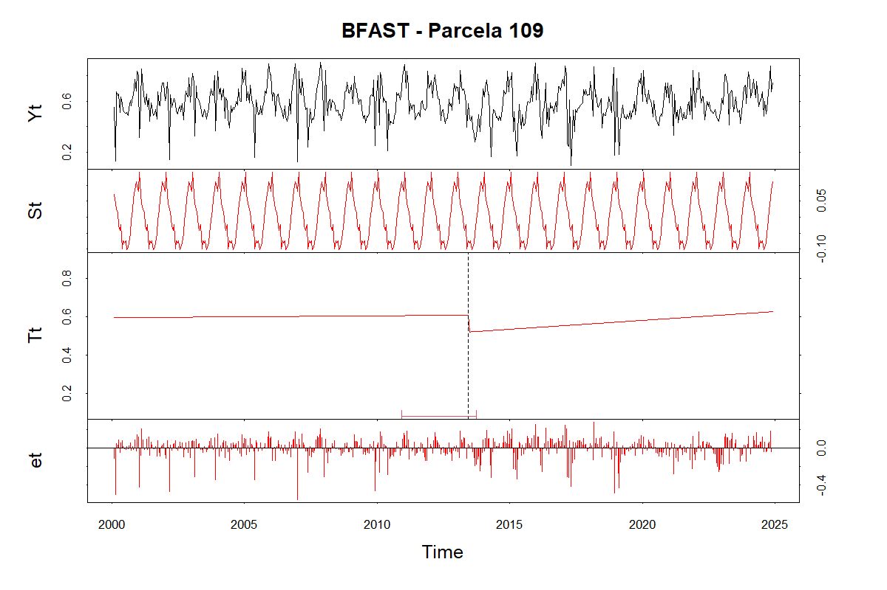
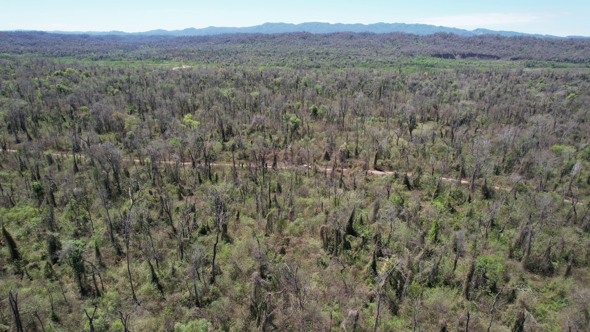

# ANALISIS DE OCURRENCIA DE DISTURBIOS EN BOSQUES DE YUNGAS DE LA CUENCA DEL RIO SECO

Este trabajo de tesina en su formato reducido se encuentra estructurado con las siguientes partes:
- Mapas
- Resultados_bruto
- RStudio
- Validacion visual
- Visita_campo

## Mapas
Aqui se encuentran los mapas elaborados para su presentacion. Podemos encontrar mapas de ubicacion, de vegetacion, de suelos, de OTBN, etc


## Resultado_bruto
En este apartado se adjuntan todos los archivos resultado de la investigacion. Como ser datos en bruto, datos procesados, tablas, graficos, plots, etc


## RStudio
Para la realizacion de los objetivos de este trabajo, fue necesario el empleo de paquetes disponibles en RStudio, particularmente el BFAST para el analisis de series de tiempo. Aqui se encuentran todos los scripts de procesamientos, automatizacion y de generacion de archivos utilizados para tal fin.



## Validacion visual
En esta carpeta se encuentran todos los archivos de respaldo para la validacion de imagenes satelitales con su correspondiente tabla de control.

## Visita_campo
En esta seccion se recopila el relevamiento fotografico con camara y dron realizado en la zona de estudio.




 ---------------------------------
 ## Estructura del Proyecto
```
root
├── Mapas
│   ├── CC_rio_SECO.png
│   ├── map-ubic-parcelas.jpg
│   ├── mapa_final.png
│   ├── mapa_hidrocarburos_OTBN_AP.png
│   ├── mapa_OTBN_AP.png
│   ├── mapa_pendiente.png
│   ├── mapa_suelos.png
│   ├── mapa_ubicacion_version2.png
│   ├── mapa_vegetacion.png
│   ├── parcelas cuenca rio seco.kml
│   ├── parcelas_bosque_vs_cultivo.png
│   └── Parcelas_cc_RioSeco.png
│
├── Resultados_bruto
│   ├── analisis_de_seriesTemporales
│   │   ├──   grafico_medias_historicas_vs_medias_años_Con-Sin-Disturbios-negativos
│   │   │   ├── plot_apilados_unico_archivo.docx
│   │   │   ├── Rplot-P112.jpeg
│   │   │   ├── Rplot_163.jpeg
│   │   │   ├── Rplot_166.jpeg
│   │   │   ├── Rplot_168.jpeg
│   │   │   ├── Rplot_198.jpeg
│   │   │   ├── Rplot_P122.jpeg
│   │   │   ├── Rplot_P136.jpeg
│   │   │   ├── Rplot_P166.jpeg
│   │   │   ├── Rplot_P93.jpeg
│   │   │   ├── Rplot_P94.jpeg
│   │   │   ├── Rplot_P98.jpeg
│   │   │   └── Rplot_SIN_P155.jpeg
│   │   ├── Analisis_estadistico_series_temporales.docx
│   │   ├── resultados_test_medias-varianzas.csv
│   │   ├── Rplot_93_Post.jpeg
│   │   ├── Rplot_P155_Sin_disturbio.jpeg
│   │   └── Rplot_P93_Con_disturbio.jpeg
│   │
│   ├── Mapas_RGB_Indices
│   │   └── P93_2010
│   │       ├── composicion_B4_B3_B2.png
│   │       ├── comp_B5-B4-B1.png
│   │       └── mapa_dif_NDVI_and_NBR.png
│   │
│   ├── plot_bfast_BR
│   │   ├── LEER.txt
│   │   ├── Magnitudes.txt
│   │   ├── P112.png
│   │   ├── P114.png
│   │   ├── P124.png
│   │   ├── P136.png
│   │   ├── P163.png
│   │   ├── P165.png
│   │   ├── P166.png
│   │   ├── P170-S.png
│   │   ├── P195.png
│   │   ├── P93.png
│   │   ├── P97.png
│   │   └── Tabla_magnitudes.xlsx
│   │
│   ├── plot_bfast_muestra
│   │   ├── bfast_parcela_109.png
│   │   ├── bfast_parcela_112.png
│   │   ├── bfast_parcela_114.png
│   │   ├── bfast_parcela_116.png
│   │   ├── bfast_parcela_117.png
│   │   ├── bfast_parcela_124.png
│   │   ├── bfast_parcela_134-S.png
│   │   ├── bfast_parcela_136.png
│   │   ├── bfast_parcela_137.png
│   │   ├── bfast_parcela_163.png
│   │   ├── bfast_parcela_165.png
│   │   ├── bfast_parcela_166.png
│   │   ├── bfast_parcela_168.png
│   │   ├── bfast_parcela_169.png
│   │   ├── bfast_parcela_170-S.png
│   │   ├── bfast_parcela_172-S.png
│   │   ├── bfast_parcela_174.png
│   │   ├── bfast_parcela_188.png
│   │   ├── bfast_parcela_192.png
│   │   ├── bfast_parcela_195.png
│   │   ├── bfast_parcela_198.png
│   │   ├── bfast_parcela_199.png
│   │   ├── bfast_parcela_204.png
│   │   ├── bfast_parcela_75.png
│   │   ├── bfast_parcela_92.png
│   │   ├── bfast_parcela_93.png
│   │   ├── bfast_parcela_94.png
│   │   ├── bfast_parcela_95.png
│   │   ├── bfast_parcela_97.png
│   │   └── bfast_parcela_98.png
│   │
│   ├── tablas
│   │   ├── 📋 Tabla_Final_Disturbios.pdf
│   │   ├── 📊 Tabla_Final_Disturbios.xlsx
│   │   ├── 📊 Tabla_Final_Disturbios_Altitud.csv
│   │   ├── 📊 Tabla_Final_Disturbios_Altitud.xlsx
│   │   └──  Tabla_Muestreo_disturbios.docx
│   │
│   ├── vistas_areas
│   │   ├── bosque_sin_disturbar_P157.png
│   │   ├── incendio_menor_P221.png
│   │   └── incendio_severo.png
│   │
│   ├── Bands_Comparison.png
│   ├── comparativa_tesis_Martin.docx
│   ├── CON_vs_SIN.docx
│   ├── disturbios_+Evidentes.docx
│   ├── EVI_desestacionalizado.xlsx
│   ├── Fotointerpretacion.docx
│   ├── Frecuencia de Posibles Disturbios.jpeg
│   ├── Img-Sat_Listado-Visual-en-tabla.pdf
│   ├── Incendio_parcelas_varias.png
│   ├── Incendio_parcelas_varias_trueColor_.png
│   ├── Muestreo_disturbios.xlsx
│   ├── Numero de BR por Año.jpeg
│   ├── Parcelas_con_BreakPoints.txt
│   ├── Parcelas_frecuencia_disturb.txt
│   ├── RESULTADOS_enBruto.docx
│   ├── resultados_test_medias-varianzas.xlsx
│   ├── TIPOS_disturbios.txt
│   └── UM_con_y_sin_BR.png
│
├── RStudio
│   ├── CSV_todas_ST_EVI
│   │   ├── appEars_ST
│   │   │   ├── all-ST-EVI-parcelas-RioSeco-MOD13Q1-061-results.csv
│   │   │   └── metadata_17414c16-6651-4df2-a88d-aa9a5a790830.zip
│   │   ├── MODIS_EVI_TimeSeries_Multiple_Points.csv
│   │   └── Nuevo Hoja de cálculo de Microsoft Excel.xlsx
│   │
│   ├──   otros_procesos
│   │   ├──   scripts_de_paso
│   │   │   └── 🔵 union_de_df_final.R
│   │   ├── analisis_ser-temp_mejorada_ind.R
│   │   ├── analisis_serie_temporal_individual.R
│   │   ├── automatizacion_pExtraccion_magnitudes.R
│   │   ├── calculo_magnitudes_extraido_de_comp_tendencia.R
│   │   ├── contabilizar_obs_fechas_disp_satelites.R
│   │   ├── evi_multi_year_viz.r
│   │   ├── generacion_planilla_control_val_visual_img_sat.R
│   │   ├── generacion_planilla_ST_con_disturbios.R
│   │   ├── guardar_result_bfast_en_png.R
│   │   ├── iterar_obtener_plotBFAST.R
│   │   ├── list-magnitudes_breakpoints_bfast.R
│   │   ├── parcelas_libres.R
│   │   ├── print_CSV_muestreo.R
│   │   ├── print_magnitudes_excel.R
│   │   └── union_con_tabla_altitud.R
│   │
│   ├── procesos-y-analisis
│   │   ├── agrup_cluster_fechas_disturb.R
│   │   ├── analisis_frecuencia_disturb_x_parcela.R
│   │   ├── automatizacion_test_t_to_muestra.R
│   │   ├── contabilizar_BR_por_Año.R
│   │   ├── contabilizar_por_estacion.R
│   │   ├── imp-PDF_excel_Lista_full_disturbios.R
│   │   ├── muestreo_df_disturbios.R
│   │   ├── plot_ST_EVI_ft_fecha_ocurrencia.R
│   │   ├── test_t_ejemplo.R
│   │   └── union_dfBreakpoint_lat_long.R
│   │
│   ├── resultados
│   │   ├── graficos_bfast
│   │   │   ├── bfast_parcela_109.png
│   │   │   ├── bfast_parcela_112.png
│   │   │   ├── bfast_parcela_114.png
│   │   │   ├── bfast_parcela_116.png
│   │   │   ├── bfast_parcela_117.png
│   │   │   ├── bfast_parcela_124.png
│   │   │   ├── bfast_parcela_134-S.png
│   │   │   ├── bfast_parcela_136.png
│   │   │   ├── bfast_parcela_137.png
│   │   │   ├── bfast_parcela_163.png
│   │   │   ├── bfast_parcela_165.png
│   │   │   ├── bfast_parcela_166.png
│   │   │   ├── bfast_parcela_168.png
│   │   │   ├── bfast_parcela_169.png
│   │   │   ├── bfast_parcela_170-S.png
│   │   │   ├── bfast_parcela_172-S.png
│   │   │   ├── bfast_parcela_174.png
│   │   │   ├── bfast_parcela_188.png
│   │   │   ├── bfast_parcela_192.png
│   │   │   ├── bfast_parcela_195.png
│   │   │   ├── bfast_parcela_198.png
│   │   │   ├── bfast_parcela_199.png
│   │   │   ├── bfast_parcela_204.png
│   │   │   ├── bfast_parcela_75.png
│   │   │   ├── bfast_parcela_92.png
│   │   │   ├── bfast_parcela_93.png
│   │   │   ├── bfast_parcela_94.png
│   │   │   ├── bfast_parcela_95.png
│   │   │   ├── bfast_parcela_97.png
│   │   │   └── bfast_parcela_98.png
│   │   ├── resultados_bfast_magnitudes.xlsx
│   │   ├── resultados_bfast_noReciente.xlsx
│   │   ├── Tabla_2020-2024.xlsx
│   │   └── Tabla_Total_fix.xlsx
│   │
│   ├── bfast-apply-all-parcelas.R
│   ├── bfast-apply-all-parcelas_v2.R
│   ├── bfast_apply_all_parcelas_AppEars.R
│   ├── bfast_apply_sample_n_5.R
│   ├── bfast_documentacion.pdf
│   ├── bfast_test_version-simple.R
│   ├── coordenadas-XY-parcelas_Altitud.csv
│   ├── coordenadas-XY-parcelas_Altitud.qmd
│   ├── Coordenadas_Grilla_Parcelas.pdf
│   ├── coordenas-XY_parcelas_original.csv
│   ├── CV-Medias-Anuales_validacion-ST.R
│   ├── EVI_muestra_desestacionalizado.csv
│   ├── script_full_automatizacionBFAST+df_ID_fechas_lat_long.R
│   ├── Script_pGEE_img-landsat.txt
│   └── Tabla_Final_Disturbios.csv
│
├── Validacion_Visual
│   ├── Bands_Comparison.png
│   ├── df_br_planilla-control-2.pdf
│   ├── df_br_planilla-control-base.pdf
│   ├── df_br_planilla-control-img-sat.pdf
│   ├── Img-Sat_Listado-Visual-en-tabla.docx
│   ├── Img-Sat_Listado-Visual.docx
│   ├── LandsatSpectralBands_20240319.png
│   ├── Parcelas_con-sin-disturbios_etiquetas.png
│   ├── planilla_control.xlsx
│   └── TABLA_Validacion_visual_COMPARATIVA.docx
│
├── Visita_campo
│   ├── fotografias
│   │   ├── bosque_disturbado
│   │   │   ├── image-4in1.jpg
│   │   │   ├── IMG_20250922_104015_324.jpg
│   │   │   ├── IMG_20250922_104534_792.jpg
│   │   │   ├── IMG_20250922_112526_137.jpg
│   │   │   ├── IMG_20250922_112921_079.jpg
│   │   │   └── plano_inclinado_incendio_severo.jpg
│   │   └──   bosque_NO_disturbado
│   │       ├── 2in1_bosque_no_disturbado.jpg
│   │       ├── DJI_0237.JPG
│   │       └── DJI_0343.JPG
│   └──   shape_parcelas_campo
│       ├── Parcelas_sugerida_visita_campo.docx
│       ├── parcelas_Visitar.kml
│       ├── Parcelas_Visitar.kmz
│       └── rutas_prov_caminos_cc_RioSeco.kml
│
├── Presentacion_Defensa.pptx
├── README.md
└── Tesina_Joel_David_Cabrera_Vivas.pdf
```

